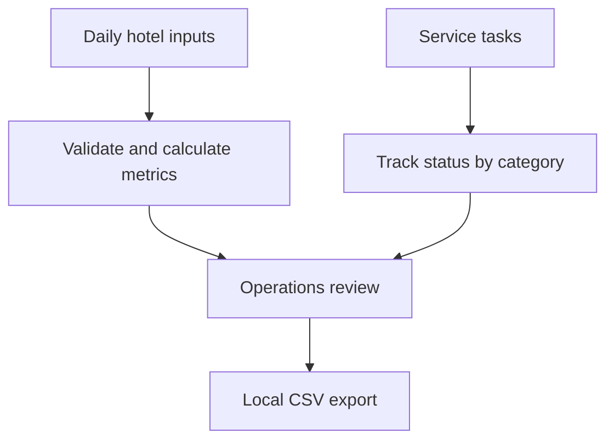
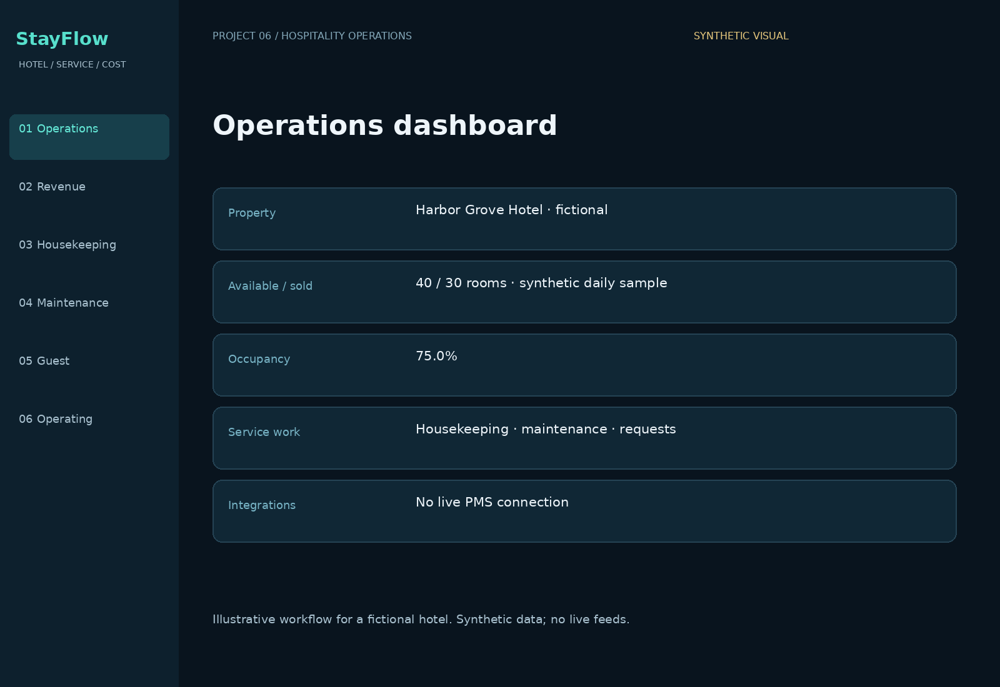
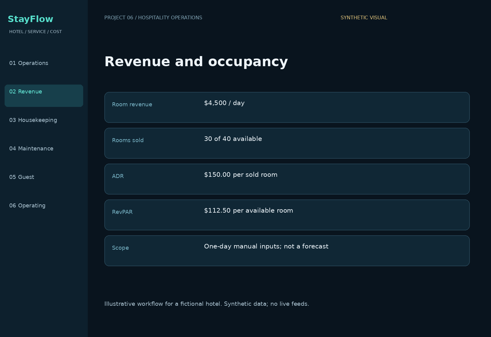
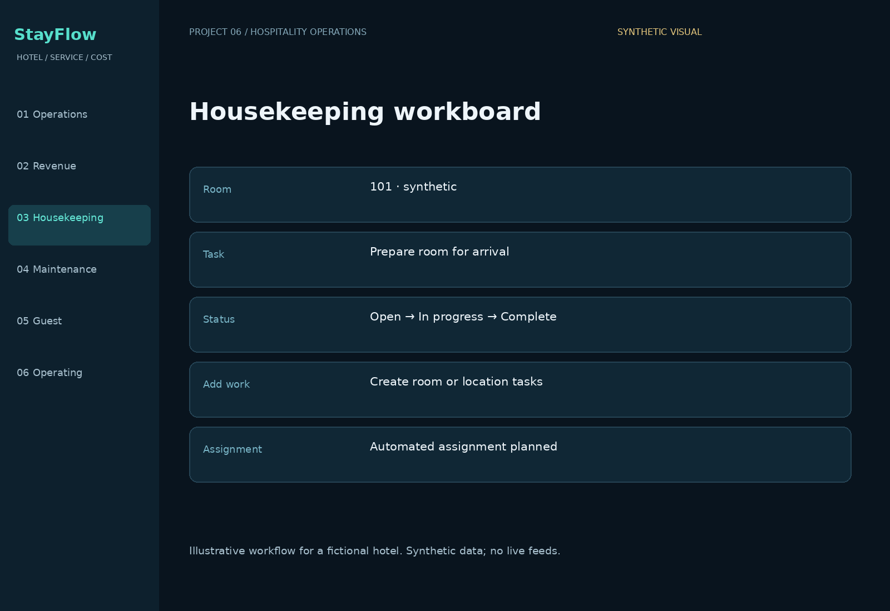
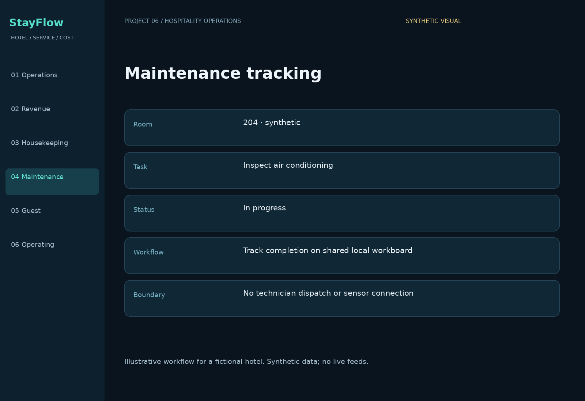
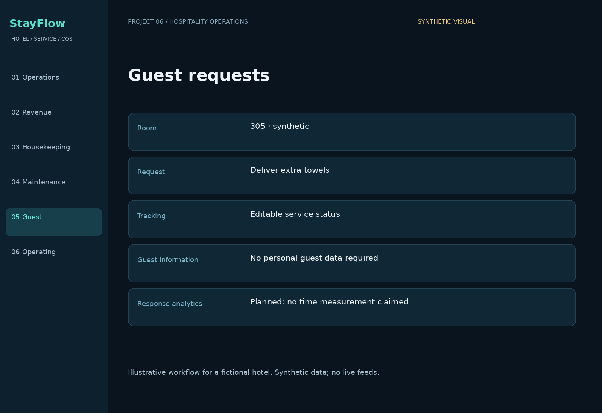
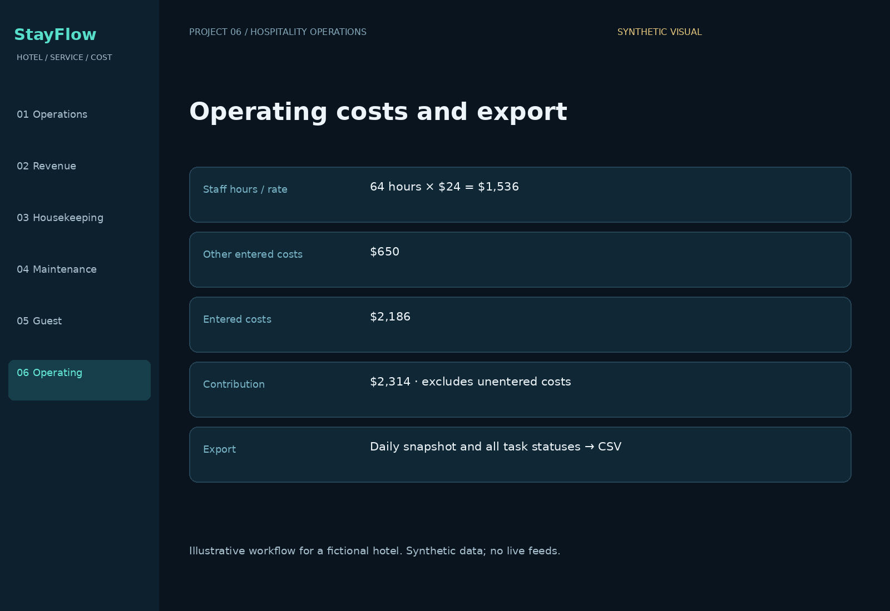

# StayFlow — Hospitality Operations & Guest Experience

**Federico Veneziano · Portfolio Project #6**

A working local prototype for a fictional hotel that brings daily occupancy, room revenue, entered operating costs, housekeeping, maintenance, and guest requests into one review workflow.

## Business problem
Hotel operators coordinate room performance and service work across departments. A simple shared view can help them identify unfinished work and review daily operating assumptions.

## Working features
- Edit available rooms, rooms sold, room revenue, staff hours, labor rate, and other costs.
- Calculate occupancy, average daily rate (ADR), revenue per available room (RevPAR), and contribution after entered costs.
- Add housekeeping, maintenance, and guest-request tasks.
- Change task status and filter the workboard by category.
- Export the daily snapshot and all task statuses as CSV.

## Run
Open `demo/index.html` in a browser. No account or installation is required. Edit inputs and select Update dashboard. Change service statuses or add a task, then export a CSV. Reload or Reset demo restores the fictional sample.

## Status and limits
| Component | Status |
|---|---|
| Daily metrics and manual cost inputs | Implemented locally |
| Task creation, filtering, and status changes | Implemented |
| CSV export | Implemented |
| Hotel PMS, bookings, guest messaging | Not connected |
| Automated assignment and response-time analytics | Planned |
| Authentication, shared database, persistent records | Planned |

**Harbor Grove Hotel and all data are fictional.** No customer project, guest identity, payment record, live hotel feed, or measured business improvement is included. Task updates are in browser memory only; this is not a multi-user hotel system. No AI model is connected.

## Metric example
40 available rooms, 30 sold, and $4,500 room revenue produce **75% occupancy**, **$150 ADR**, and **$112.50 RevPAR**. 64 staff hours × $24 = $1,536 labor. Adding $650 other costs gives $2,186 entered costs and $2,314 contribution. Contribution is **not net profit** and excludes all costs not entered. ADR is N/A when no rooms are sold.

## Workflow

## Portfolio visuals
Six illustrated workflow views using synthetic data, not live application screenshots.

### Operations dashboard

### Revenue and occupancy

### Housekeeping workboard

### Maintenance tracking

### Guest requests

### Operating costs and export

## Repository guide
- `demo/index.html`: working local interface.
- `src/operations.js`: metrics, task transitions, and CSV helpers.
- `examples/fictional-hotel.json`: sample operating data.
- `docs/architecture.md`: current implementation and planned integrations.
- `docs/case-study.md`: problem, contribution, and measurement plan.
- `tests/operations.test.cjs`: metric and task logic checks.

Run checks with `node tests/operations.test.cjs`.

## Skills demonstrated
Service operations · financial analysis · KPI design · task workflows · cross-industry product design · human review · input validation.
